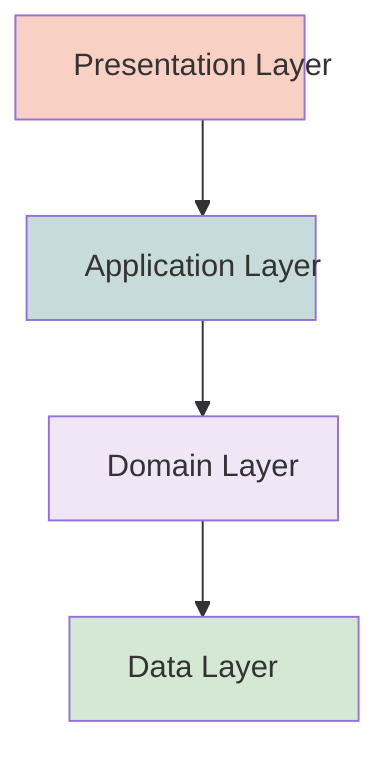

# Architecture for RattleNG

## Goals

- Clean code;
- Testable code;
- Easily extensible and adaptable code base
- Ideally, be able to replace the state management choice without
  impacting the project

## Principles

- **Separation of concerns**: each component of the app should have a
  clear and specific responsibility, and should not depend on or
  interfere with other components, to make code more modular,
  reusable, testable, and maintainable.

- **Single source of truth**: there should be only one place where the
  app state and data are stored and updated, and all other components
  should react to the changes in that source, to make the app more
  consistent, reliable, and predictable.

- **Dependency injection**: each component of the app should receive
  its dependencies (such as services, repositories, models, etc.) from
  an external source, rather than creating them internally, to make
  your code more flexible, decoupled, and easy to mock or override for
  testing or development purposes.

- **Abstraction**: each component of the app should communicate with
  other components through interfaces or contracts, rather than
  concrete implementations, to make the code more generic, adaptable,
  and extensible.

## Riverpod

Riverpod supports these principles easily and effectively.  

Riverpod providers are used to create and manage the app state and
data, and to inject them into the UI or business logic components. 

Riverpod providers can also be used to create and combine different
kinds of abstractions, such as state providers, future providers,
stream providers, etc.

It is a good idea to review different suggestions for the
architecture. The RiverPod documentation does not provide any guide as
to the architecture, and so it is good to find some opinions around
the Internet for references and inspirations, but do not blindly copy
or follow them without understanding the rationale behind them.

## Architecture for RattleNG

Exploring mermaid for inline diagrams: https://mermaid.live/edit

