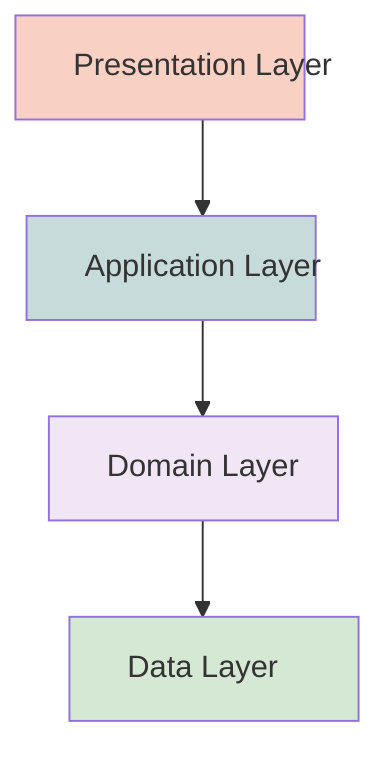

# RattleNG Architecture

## Goals

- Clean code;
- Testable code;
- Easily extensible and adaptable code base
- Ideally, be able to replace the state management choice without
  impacting the project

## Principles

- **Separation of concerns**: each component of the app should have a
  clear and specific responsibility, and should not depend on or
  interfere with other components, to make code more modular,
  reusable, testable, and maintainable.

- **Single source of truth**: there should be only one place where the
  app state and data are stored and updated, and all other components
  should react to the changes in that source, to make the app more
  consistent, reliable, and predictable.

- **Dependency injection**: each component of the app should receive
  its dependencies (such as services, repositories, models, etc.) from
  an external source, rather than creating them internally, to make
  your code more flexible, decoupled, and easy to mock or override for
  testing or development purposes.

- **Abstraction**: each component of the app should communicate with
  other components through interfaces or contracts, rather than
  concrete implementations, to make the code more generic, adaptable,
  and extensible.

## Riverpod

Riverpod supports these principles easily and effectively.

Riverpod providers are used to create and manage the app state and
data, and to inject them into the UI or business logic components.

Riverpod providers can also be used to create and combine different
kinds of abstractions, such as state providers, future providers,
stream providers, etc.

It is a good idea to review different suggestions for the
architecture. The RiverPod documentation does not provide any guide as
to the architecture, and so it is good to find some opinions around
the Internet for references and inspirations, but do not blindly copy
or follow them without understanding the rationale behind them.

## Plot Rendering

Rattle's plots are generated by R as **SVG**, written to the session
temporary directory by the `svg()` calls in `assets/r/`, and displayed
by `ImagePage` (`lib/widgets/image_page.dart`) through `flutter_svg`.
Keeping the plots as vectors is deliberate: they stay sharp when
enlarged, and the SAVE button can hand the user the original SVG to
edit in an application like Inkscape.

Two decisions there are worth recording, both made 2026-08-15.

**We render with Skia, not Impeller.** Flutter 3.47.0 made Impeller the
default renderer on Linux (engine commit `fa137457bad`, "Turn linux
impeller on by default", 2026-06-24). Under Impeller the plot text
turned blurry and the thin grid lines aliased badly, to the point where
a box plot title was hardly readable, with no change to Rattle itself.
The cause is two Impeller behaviours on Linux, neither of them tunable:
`fl_engine.cc` always appends `--impeller-use-sdfs`, so glyphs go
through signed distance field rendering, and that switch is read with
`HasOption`, a presence check, so passing `=false` does not disable it;
and line antialiasing is off by default, its
`--impeller-antialias-lines` switch still being described upstream as
experimental. Impeller is therefore turned off in
`linux/my_application.cc` with
`fl_dart_project_set_enable_impeller(project, FALSE)`. It has to be done
in the runner because the `FLUTTER_ENGINE_SWITCHES` environment
variables, which are handy for testing:

```bash
FLUTTER_ENGINE_SWITCHES=1 FLUTTER_ENGINE_SWITCH_1=enable-impeller=false \
  build/linux/x64/debug/bundle/rattle
```

are compiled out of release builds. This is a stopgap. Skia is on its
way out of the engine, so revisit it when Impeller's text and line
rendering improves, or if a future Flutter drops Skia entirely.

**The plot fills the available width.** The viewing area used to be a
square with sides of the smaller of the available width and height.
Since the plots are 10 by 7 inches, squaring the viewing area fitted
them by their width and left the plot some 30% smaller than the space
allowed, the text that much less readable, and a wide empty margin
either side. `ImagePage` now takes the full width and leaves
`BoxFit.contain` to scale the plot to its own aspect ratio. A square
plot still fits, scaled to the height, and is centred within the width.

## Architecture for RattleNG

Exploring mermaid for inline diagrams: [edit](https://mermaid.live/edit)


```mermaid
graph TD
    style presentation fill:#f9d0c4, width:150px
    style application fill:#c6dbda, width:150px
    style domain fill:#f0e6f6, width:150px
    style data fill:#d5e8d4, width:150px
    presentation[Presentation Layer]
    application[Application Layer]
    domain[Domain Layer]
    data[Data Layer]
    presentation --> application
    application --> domain
    domain --> data
```
