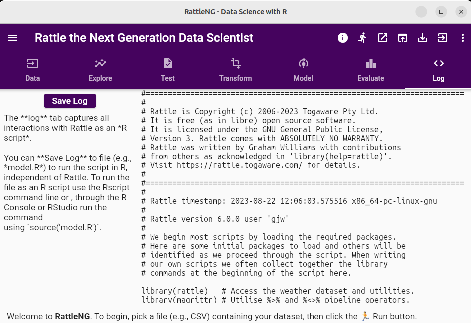

# Rattle the Next Generation Data Scientist

Rattle has been taken up by educators, consultants, industry, and
government as an application for the data scientist. After over 15
years it is time for a refresh. RattleNG adheres to the familiar
Rattle style with a modern user interface refresh implemented in
Flutter. Don't worry, the underlying R foundations remain. The R
rattle package will be updated to support template scripts that will
be utilised in RattleNG for its powerful functionality.

Some teasers:

  

**The traditional Rattle Welcome**

  

**Exploring Data Visually**

  

**Everything Captured as Scripts**

