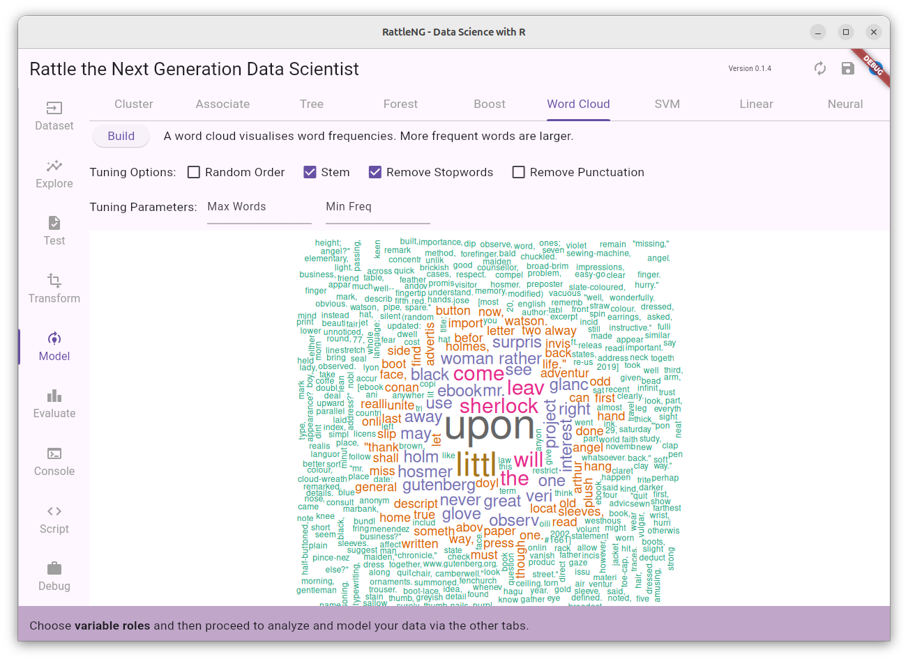

# Rattle the Next Generation Data Scientist

Rattle has been in development and use for almost 20 years as a Data
Mining and now Data Science toolkit for the apprentice and practising
Data Scientist. The open source software and it books and papers have
been used by educators, consultants, and practitioners across industry
and government, to turn data into knowledge, through machine learning
and artificial intelligence.

But now, it is time for a refresh. To install the new Rattle visit the
[Installers](https://github.com/gjwgit/rattleng/tree/dev/installers/README.md).

RattleNG, available from [github](https://github.com/gjwgit/rattleng),
remains sympathetic to the original Rattle user interface,
functionality, and goals, as presented in the
[Rattle](https://bit.ly/rattle_data_mining) book. However, it brings
to the community a modern user interface refresh implemented in
**Flutter**. The underlying **R** foundations remain firmly in place
and encapsulated within a more readily extensible framework. A new
edition of the Rattle book will soon be available.

Over the past 15 years we have also matured in how we deliver data
science and analytics. RattleNG delivers a new perspective on
scripting data science in R through templates as introduced in my more
recent book, *The Essentials of Data Science*
(https://bit.ly/essentials_data_science). The concept of templates for
data science now provides the foundations for a flexible and
extensible application in RattleNG.

You can also review my Desktop Data Mining Survival Guide published
online by Togaware, available from (https://datamining.togaware.com).

The detailed coding documentation for our new Flutter/Dart based
RattleNG is available online from the [Solid Community
AU](https://solidcommunity.au/docs/rattleng/).

The RattleNG rewrite is being lead by Professor Graham Williams (the
original Rattle author), Chief Scientist of the Software Innovation
Institute of the Australian National University.  Significant
contributions have also been made by Yixiang Yin.

## Quick Start and Current Status 2024-07-07

You will need to install R, separate to the  app itself. Visit
https://www.r-project.org/ for details.

Then install RattleNG for your operating system as detailed below.

Then:

+ Start RattleNG.
+ Tap the **Script** tab to see the R code that has been run.
+ Tap the **Console** tab to see the R code being run within an R
  session. You can even type R commands there to have them run.
+ Tap the **Dataset** tab to return the to startup screen for
  RattleNG. Tap the **Dataset** button and then choose **Demo** to
  load the `rattle::weather` dataset. You can also load your own CSV
  or TXT file by tapping the **Filename** button instead. The result
  panel of the page will provide view or summary of the dataset.
+ Notice the toggle buttons to the top right of the tab page:
  **Cleanse**, **Normalise** and **Partition**. Hover the mouse to
  view the tooltips.
+ Tap the **Model** tab and then the **Tree** radio button (selected
  by default) and then the **Build** button to build and view a
  decision tree from a CSV dataset. Scroll the window to see the whole
  tree.
+ Tap the **Script** tab and scroll the window to view the latest R
  commands run. Then tap the **Export** button to save the full script
  to `script.R` (no options currently to change the name or location
  of the saved script file).
+ From your own command line run `Rscript script.R`

Currently implemented features:

+ Dataset
  + CSV
  + Demo
+ Explore
  + Summary
  + Correlation
+ Model
  + Cluster
  + Tree
  + Forest
  + Word Cloud
+ Console
+ Script

## Installing RattleNG from Pre-Built Packages

The basic process is to install the [R statistical
software](https://cloud.r-project.org/), then fire up R to install the
pre-requisite packages:

```r
install.packages(c("rattle", "magrittr", "janitor", "tidyverse"))
```

Then you can install the rattleng app from the packages available on
github or snap or build it yourself from source.

Specific OS instructions follow.

### Linux

+ Install R
  + Debian/Ubuntu: `wajig install r-recommended`
+ Install required R packages
  + `> install.packages(c("rattle", "magrittr", "janitor", "tidyverse"))`
+ Install RattleNG with `snap install --dangerous rattle.snap`

The *dangerous* refers to side-loading the app from outside of the
snap store. This will not be required for the snap store version but
for this development version we are side-loading the package.

### MacOS

Please check back later.

### Windows

+ Download and install R
  + Visit https://cloud.r-project.org/ and navigate to Windows install
  + Click on *Download R for Windows*
  + Open the downloaded file to install R into *C:\Program Files\R*
  + Add *C:\Program Files\R\bin* to the PATH environment variable
    + Open *Edit the system environment variables* from Control panel
	+ Click *Environment Variables...*
	+ Click the *Path* entry and then *Edit...*
    + Click *New* and then add *C:\Program Files\R\bin*
    + Click *OK* a few times to close the windows.
+ Download https://rattle.togaware.com/rattle.msix
+ Add the rattle certificate to your store:
  + Right click the downloaded file in Explorer
  + Choose *Properties*
  + Choose the *Digital Signatures* tab. 
  + Highlight the *Togaware* line
  + Click *Details*. 
  + Click *View Certificate...* 
  + Click *Install Certificate...*
  + Choose *Local Machine*
  + Click *Next*
  + Choose *Place all certificates in the following store*
  + Click *Browse...*
  + Select **Trusted Root Certification Authorities**
  + Click *OK*
  + Click *Next* and *Finish*.
  + A popup says **The import was successful**
+ Open the downloaded `rattle.msix` to install and run rattle
  + Or in PowerShell: `Add-AppxPackage -Path .\rattle.msix`

## Running RattleNG from Source

Ensure you have R installed, as described above. Also you will need to
install Flutter.

Then clone the rattleng repository:

```bash
git clone https://github.com/gjwgit/rattleng
cd rattleng
flutter run -d <os>
```

Replace `<os>` with `linux`, `macos`, or `windows`.

After firing up the rattleng app, check in the Console tab to make
sure the following packages were loaded:

```r
library(rattle)
library(magrittr)
library(janitor)
library(tidyverse)
glimpse(weather)
```

RattleNG will eventually check for these and prompt if they are not
available.

### Latest Code

RattleNG is currently under active development. To get the current app
you can install flutter on your local computer, then clone the github
repository, to your local disk, and from a command line change to the
directory where you cloned the rattle repository (it should contain a
`lib` sub-directory) and type the following command, changing `<os>`
to be one of `windows`, `macos`, or `linux`.

```
flutter run -d <os>
```

## How you can Help

RattleNG will remain an open source application, free for anyone to
use in any way they like. Contributions are welcome and the simplest
is to make them through pull requests on github. You can fork my
repository, make your changes, and push them back as a pull request to
my repository where I can review and merge into the main product.

There is plenty to do, and if you have a favourite part of Rattle,
consider either implementing the GUI in Flutter for that component, or
else write a simple template R script that takes a dataset `ds` and
any other template parameters (as ``<<PARAMETER>>`` in the script) to
then do it's stuff! The `<<PARAMETER>>` strings are filled in by the
Flutter interface. See the growing number of scripts in `assets/scripts/`

Suggested tasks can be found as github issues.

### Install Flutter on Windows

+ Download the flutter sdk
+ Unzip it to your home folder
+ Add C:\Users\<user>\flutter\bin to Path
+ In a CMD console run `flutter help`

Currently (20230918), on Azure Windows VM, `flutter doctor` just sits
there!

## Rattle Resources

+ Bob Meunchen's review of Rattle: https://r4stats.com/articles/software-reviews/rattle/

## Some RattleNG teasers

### Rattle's 4 Click First AI Model

The traditional Rattle Welcome screen provides an overview of
Rattle. To build your first model, simply click the **Dataset** button
to choose **Demo**, which will load the `rattle::weather`
dataset. Then click the **Model** tab and the **Build** button and
your first decision tree (an AI model) will be displayed in the text
window.


Click the **Dataset** button to have options to load the data from a
file, from an R package, or the demo weather dataset.


After the data is loaded we are presented with a summary.


### Exploring Data Visually

All of the popular Rattle visualisations are available, modernised
using `ggplot` and the `tidyverse`.


### Summarising Through WordClouds

For a text file we can gain an insight into the document through a
word cloud.



### Building Models

A decision tree model is one of the most widely built AI models.


### The R Console

The R console is where everything in R happens. The user can review
the contents of the console and even run R commands themselves. Click
the **Export** button to have the history of R commands from the
console saved to file. Compare this **Export** to that of the
**Script** page where a documented and formatted script is saved to
file.


### Everything Captured as Scripts

An be assured, the most important of functionalities, the **Script**
tab's capturing of your interactions remains a key feature of
Rattle. Indeed, all of your interactions with R through Rattle are
captured as a documented and nicely formatted script that you can save
to file and replicate your whole project simply by asking R to run the
script. It is also he starting point for modifying a script to do
precisely what you want, beyond what Rattle supports. No lock-in.


