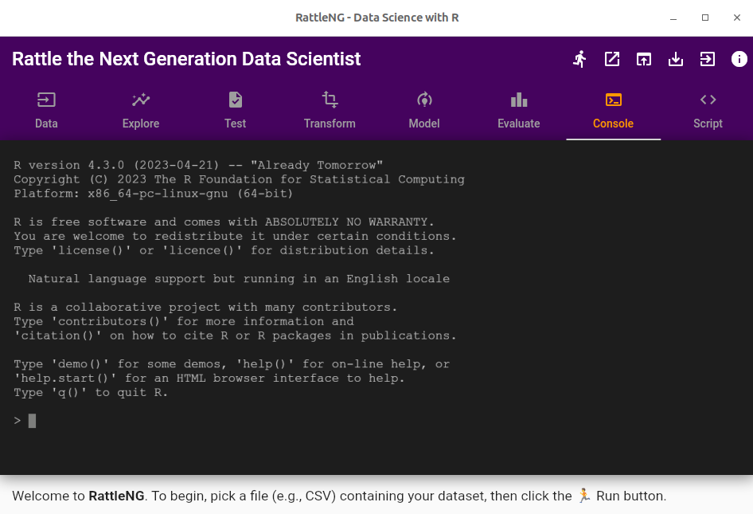
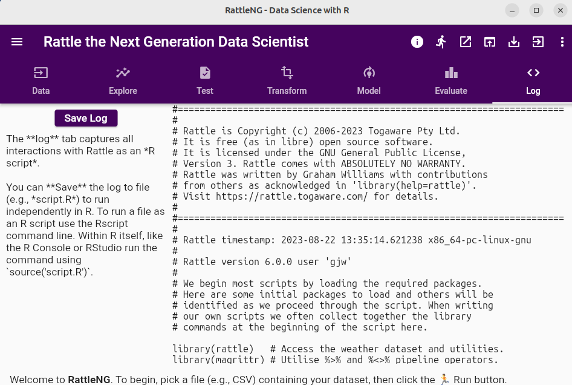

# Rattle the Next Generation Data Scientist

Rattle has been in development and use for more than 15 years as a
Data Mining and now Data Science toolkit. It is used by educators,
consultants, and practitioners across industry and government, to turn
data into knowledge, through machine learning and artificial
intelligence.

It is time for a refresh.

RattleNG will adhere to the familiar Rattle style presented in the
Rattle book (https://bit.ly/rattle_data_mining) with a modern user
interface refresh implemented in **Flutter**. RattleNG will be
symphathetic to the published Rattle interface.  Don't worry, the
underlying **R** foundations remain and **Python** is being added to
the mix.

The underlying architecture has undergone quite a change with the
maturing of our technology over the years. As I introduced in my more
recent book, *The Essentials of Data Science*
(https://bit.ly/essentials_data_science), the concept of templates for
data science now provides the foundations for a flexible and
extensible application in RattleNG. 

The open access Togaware Desktop Data Mining Survival Guide even more
recently provides current Rattle and template documentation and is
available from Togaware (https://datamining.togaware.com).

## How you can Help

RattleNG will remain an open source application, free for anyone to
use in any way they like. Contributions are welcome and the simplest
is to make them through pull requests on github. You can fork my
repository, make your changes, and push them back as a pull request to
my repository where I can review and merge into the main product.

There is plenty to do, and if you have a favourite part of Rattle,
consider either implementing the GUI in Flutter for that component, or
else write a simple template R script that takes a dataset `ds` and
any other template parameters (as ``<<PARAMETER>>`` in the script) to
then do it's stuff! The `<<PARAMETER>>` strings are filled in by the
Flutter interface. See the growing number of scripts in `assets/scripts/`

Suggested tasks can be found as github issues.

## Current Status 2023-09-17

+ Startup the app
+ Click the Script tab to see the R code that has already been run
+ Click the Dataset tab and then choose Demo to load the
  `rattle::weather` dataset and view the dataset summary.
+ Click the Model tab

## Rattle Resources

+ Bob Meunchen's review of Rattle: https://r4stats.com/articles/software-reviews/rattle/

## Some RattleNG teasers

### Rattle's 4 Click First AI Model

The traditional Rattle Welcome screen provides an overview of
Rattle. To build your first ever AI model, simply click the Run
button, which will load the `rattle::weather` dataset. Then click the
Model tab and the Run to build your first decision tree (an AI
model). Click the View button to see how the model is represented
visually.

*More screenshots to come.*

### Exploring Data Visually

All of the popular Rattle visualisations are available, modernised
using `ggplot` and the `tidyverse`.

### The R Console

The R console is where everything in R happens. The user can review
the contents of the console and even run R commands themselves. Click
the EXPORT button to have the history of R commands from the console
saved to file. Compare this EXPORT to that of the LOG page where a
documented and formatted script is saved to file.

### Everything Captured as Scripts

An be assured, the most important of functionalities, the Script
generator, remains a key feature of Rattle. All of your interactions
with R through Rattle are captured as a documented and nicely
formatted script that you can save to file and replicate your whole
project simply by asking R to run the script. Or, it is the starting
point for modifying a script to do precisely what you want, beyond
what Rattle supports. No lock-in.

