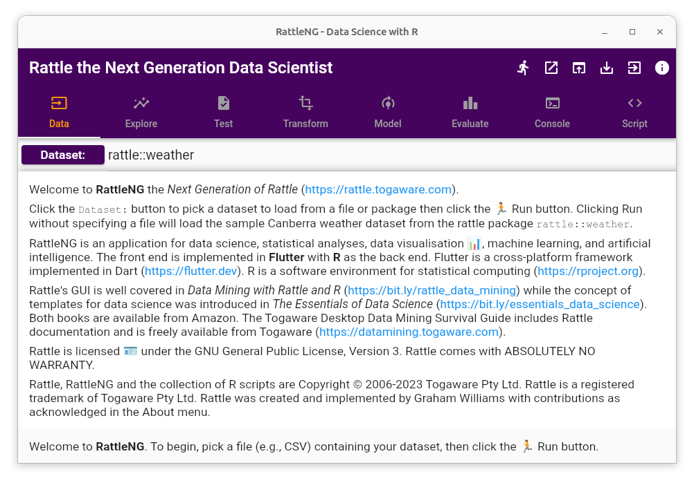
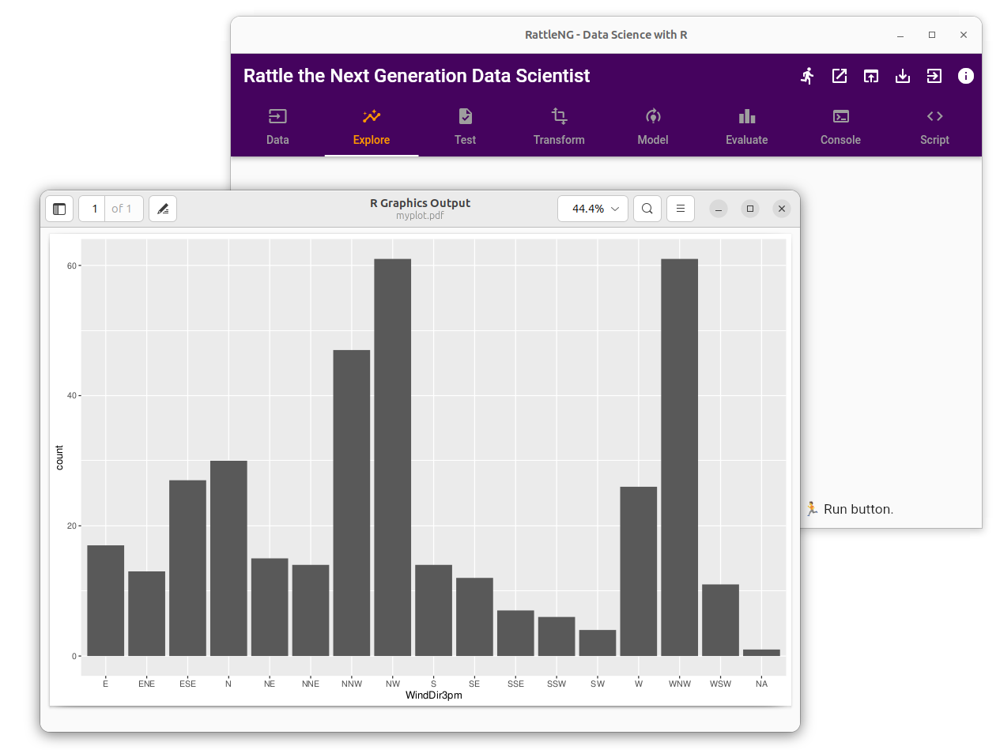

# Rattle the Next Generation Data Scientist

Rattle has survived for more than 15 years as a Data Mining and now
Data Science toolkit. It is used by educators, consultants, industry,
and government to turn data into knowledge, through machine learning
and artificial intelligence.

It is time for a refresh. 

RattleNG will adhere to the familiar Rattle style with a modern user
interface refresh implemented in **Flutter**. Don't worry, the
underlying **R** foundations remain. The R rattle package will be
updated to support template scripts that will be utilised in RattleNG
for its powerful functionality.

My original Rattle book, *Data Mining with Rattle and R*
(https://bit.ly/rattle_data_mining) describes the original Rattle
application and user interface. RattleNG will be symphathetic to that
interface. My later book, *The Essentials of Data Science*
(https://bit.ly/essentials_data_science) introduced templates for data
science and provides the foundations for the templates being used in
RattleNG. Both are available from Amazon. The Togaware Desktop Data
Mining Survival Guide includes Rattle documentation and is available
from Togaware (https://datamining.togaware.com).

## Some RattleNG teasers

### The traditional Rattle Welcome

### Exploring Data Visually

### Everything Captured as Scripts

